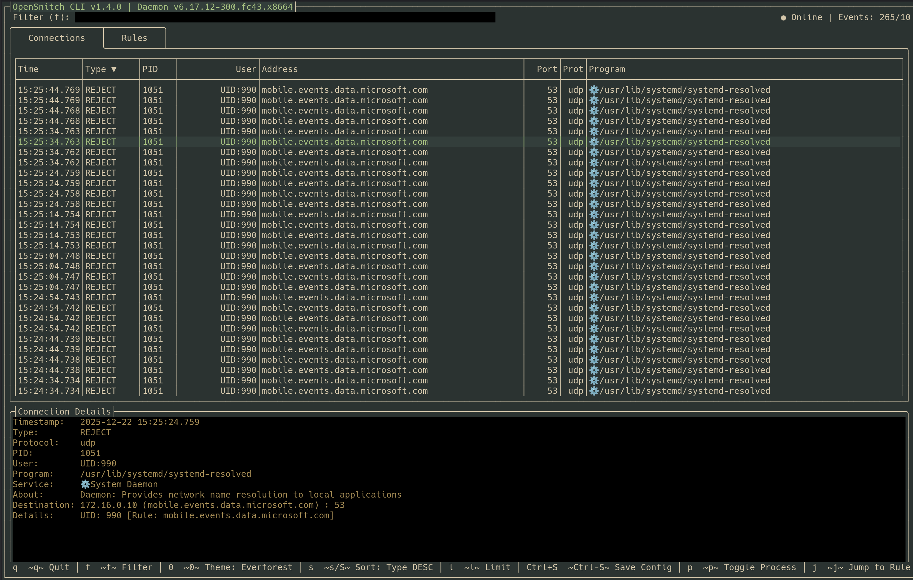
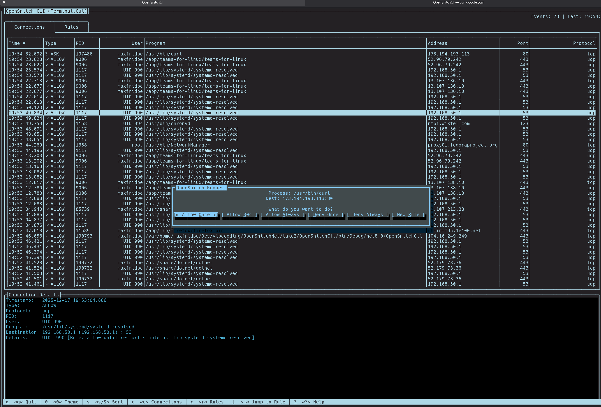

# OpenSnitch C# CLI Listener

This is a C# CLI application that acts as a modern OpenSnitch UI. It listens for connections from the OpenSnitch daemon (`opensnitchd`) and displays received messages in a rich, interactive Terminal User Interface (TUI).




## Feature Parity Checklist (vs Python opensnitch-ui)

- [x] **Live Connection Monitoring:** Real-time streaming of all network activity.
- [x] **Rule Management:** Dedicated tab to list all active daemon rules.
- [x] **Interactive Prompts:** Popup dialogs for new/unknown connections.
- [x] **Custom Rule Creation:** Advanced dialog to match on Path, Comm, Host, IP, Port, or UID.
- [x] **Rule Editing:** Modify Action, Duration, and Data of existing rules on the fly.
- [x] **Rule Deletion:** Remote deletion of rules from the daemon with confirmation.
- [x] **Multi-column Sorting:** Sort by any column (s/S) with secondary "Newest First" logic.
- [x] **Process Details:** Deep inspection of PID, Path, User, and Command Line args.
- [x] **Reverse DNS Resolution:** Background lookups via Cloudflare DoH.
- [x] **User Resolution:** Automatic mapping of UIDs to local system usernames.
- [x] **Container & Daemon Detection:** Visual indicators for Namespaces/Containers (📦) and System Services (⚙️).
- [x] **Quick Navigation:** Jump directly from a connection event to its applying rule ('j' key).
- [x] **Theme Support:** 15+ color schemes including OneDark, TokyoNight, Kanagawa, RosePine, and Cobalt2. Supports **HEX colors** (#RRGGBB).
- [x] **Live Theme Editor:** Interactive dialog (press **e** in Connections tab) to customize colors live with dropdown selection.
- [x] **Persistent Settings:** Save and load UI state (theme, sort, filter, limit) via `~/.config/opensnitch-cli/config.json`.
- [x] **Manual Configuration Save:** Use `Ctrl+S` to save current settings with a confirmation dialog.
- [x] **Packaging Support:** Automated generation of **RPM, DEB, and AppImage** packages via containerized builds.
- [x] **Notification System:** System beep on prompt to grab attention (rate-limited).
- [x] **Global Search/Filtering:** Real-time filtering of connection or rule lists, including full-path filtering.
- [x] **Dynamic Layout:** Column auto-sizing for addresses and flexible "Program" column that absorbs remaining space.
- [ ] **Daemon Config:** Manage daemon-wide settings (InterceptUnknown, etc.) via UI.
- [ ] **Firewall Viewer:** Display system-level nftables/iptables chains and rules.
- [ ] **Statistics Charts:** Real-time graphing of connections and rule hits.
- [ ] **Rule Export/Import:** Backup and restore rules to/from files.

## Prerequisites

- **.NET 8.0 SDK** (or later)

## Features

- **Dual TUI Modes:** 
    - **Terminal.Gui v2 Mode (Default):** Full interactive grid with tabs, sorting, themes, and rule management.
    - **Spectre.Console Mode (`--tui`):** A high-performance, beautiful streaming view with fixed details pane.
- **Global Hotkeys:** Responsive controls ('q', '0', 's', 'j', 'e', 'd', 'c', 'r', 'Ctrl+S') that work regardless of current focus.
- **Advanced Theme System:** Support for HEX colors and 40+ named colors. Includes a built-in live editor for real-time customization.
- **Persistent Configuration:** Automatically loads settings from `~/.config/opensnitch-cli/config.json`. Supports manual saving via `Ctrl+S`.
- **Smart Data Resolution:** DNS and User mappings handled automatically in the background.
- **Enhanced Process Context:** Deep inspection of `/proc` and cgroups to identify Docker, Podman, LXC, Flatpak, Snap, and system daemons.

## Setup

1.  Ensure the official OpenSnitch UI is **NOT** running, as this application needs to bind to `/tmp/osui.sock` (Unix socket).
2.  Navigate to the project root or `OpenSnitchCli` directory.

## How to Run

### Default: Terminal.Gui v2 (Full Interactive)
```bash
cd OpenSnitchCli
dotnet run
```

### With Custom Configuration
```bash
dotnet run -- --cfg my-config.json
```

### Generate Sample Configuration
```bash
dotnet run -- --gen-cfg
```

### Build Distribution Packages (RPM, DEB, AppImage)
```bash
./publish.sh
```

### Mode 2: Spectre.Console (Streaming View)
```bash
cd OpenSnitchCli
dotnet run -- --tui
```

### Mode 3: JSON Raw Output (Dumping Mode)
```bash
cd OpenSnitchCli
dotnet run -- --dump
```

### Help Information
```bash
cd OpenSnitchCli
dotnet run -- --help
```

## Configuration

By default, the application:
1. Starts a gRPC server on `127.0.0.1:50051`.
2. Starts an internal UDS Proxy that bridges `/tmp/osui.sock` to the TCP port, ensuring compatibility with the daemon.

## Runtime Controls

| Key | Action |
| :--- | :--- |
| **Arrow Keys** | Navigate through the lists. |
| **q** | Quit the application. |
| **f** | Focus the Filter bar (Connections: Process, Rules: Name). |
| **Ctrl + s** | **Save current settings** to configuration file. |
| **0** | Cycle through visual themes. |
| **s** | Cycle sorting column. |
| **S (Shift+S)** | Toggle sort direction. |
| **l** | Cycle event history limit (50 - 1000). |
| **c** | Switch to Connections tab. |
| **r** | Switch to Rules tab. |
| **j** | Jump to the rule applying to selected connection (Connections Tab). |
| **p** | Toggle full process command args in "Program" column (Connections Tab). |
| **t** | Toggle selected rule Enabled/Disabled (Rules Tab). |
| **e** | **Open Theme Editor** (Connections Tab) or Edit Rule (Rules Tab). |
| **d** | Delete the selected rule (Rules Tab). |
| **?** | Show Help dialog. |

## Troubleshooting

- **Icon Visibility:** If you don't see 📦 or ⚙️ icons, ensure your terminal supports UTF-8 and its font includes emoji glyphs. Note that daemon and container detection requires permissions to read `/proc` files; running the CLI with `sudo` is recommended for full accuracy.
- **Crash Logs:** If the application crashes, check `opensnitch_tui_debug_*.log` in your temp directory for detailed logs.
- **No Events:** Ensure `opensnitchd` is running (`sudo systemctl status opensnitch`). Verify no other process is using `/tmp/osui.sock`.
